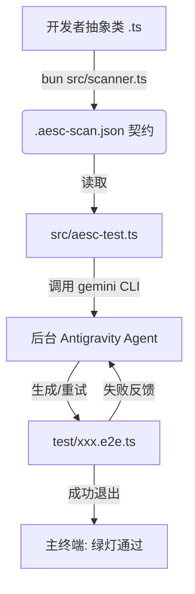

# PRD 003: AetherScript 2.0 (Polyglot Agentic Architecture)

## 概述
将 AetherScript 升级为 Antigravity 的原生协作生态，通过剥离语言特定的解析器（TS/Java）与基于 Python SDK 的控制流 Agent，实现跨语言、自动重试、真正强制执行的“黑盒测试与代码生成”闭环。

## 用户故事
作为一名使用 Antigravity 的开发者，我希望在完成抽象类契约设计后，能一键触发黑盒测试的生成。在此期间，我不希望被满屏的报错和重试日志打扰，我只想看到 Agent 在后台静默运行、修正代码，直到测试完全跑通，并告诉我“测试生成完毕”。

## 功能边界
### 必须实现 (MVP)
- 保留现有的 `scanner.ts` 作为数据源提取工具。
- 新增 `src/aesc-test.ts`，原生支持 TS 生态，并通过调用系统的 `gemini` CLI 进行任务执行。
- TS 脚本能读取 `.aesc-scan.json`，并根据 `testType` 组装 Prompt。
- **内部死循环能力由 Antigravity CLI 原生提供**：通过 `gemini -y -p "..."`，CLI 内置的 Agent 会自动读写文件、运行测试命令，失败自动截取错误并重试，直到成功。
- `.aesc-scan.json` 契约支持下发 `testCommand`，实现测试执行命令在契约中定义。

### 不在范围内
- 暂不实现 Python 版本的 `aesc-gen`（后续迭代，MVP 聚焦测试闭环）。
- 暂不实现跨机器的 RPC 调用（全程在本地 Antigravity 宿主执行）。

## 架构模型

## 业务规则
1. **测试执行指令下放**：Python 脚本不硬编码如何测试 TS 代码，相关的命令（如 `bun test` 或 `bun run test:e2e`）必须由 `.aesc-scan.json` 中的 `testCommand` 给出。
2. **错误截断**：测试失败时，若 stderr 过长，必须截取尾部关键报错返回给 AI，防止 Token 爆炸。
3. **最大重试限制**：支持最大重试次数（默认 3 次），超过则优雅退出并提示用户接管。

## 边界条件
- 若系统中未安装 `google-antigravity`，需抛出友好提示，指导运行 `pip install`。
- 若生成的测试代码导致进程挂起（如死循环），需加入子进程执行的 Timeout 保护。

## 非功能需求
- 代码必须是易于跨平台运行的纯 Python 和纯 TS。
- AetherScript 的整体发布包仍可以通过 `npm` 安装，Python 依赖由用户自行满足（在文档中声明）。
- 无 IPC，全链路均为本地 Agent 流调用。
